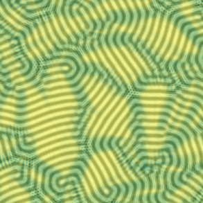

# Example 1 - Response Distance

See [here](https://github.com/uw-comphys/shapelets/tree/main/examples/example_1) for files and code related to this example. 

This example demonstrates the response distance method ([R. Suderman (2015)](https://doi.org/10.1103/PhysRevE.91.033307)) implemented in ``shapelets.self_assembly.quant.rdistance`` for a simulated stripe self-assembled nanostructure image ([R. Suderman (2015)](https://doi.org/10.1103/PhysRevE.91.033307)).

## Overview

The response distance ([R. Suderman (2015)](https://doi.org/10.1103/PhysRevE.91.033307)) is calculated as:

$$ d_{i, j} = \min \| \vec{R} - \vec{r_{i,j}} \|_2 $$

where $\vec{r_{i,j}}$ denotes the given response vector at pixel location $\{i, j\}$ and $\vec{R}$ is the reference set (or subdomain) of response vectors.

## Configuration File

### Setup

The example [config](https://github.com/uw-comphys/shapelets/tree/main/examples/example_1) contains the following:

	[general]
	image_name = lamSIM1.png
	method = response_distance

	[response_distance]
	shapelet_order = default
	num_clusters = 20
	ux = [50, 80]
	uy = [150, 180]

where **image_name** and **method** are required parameters that specify the image filename and method used for analysis, respectively.

The **response_distance** method may contain up to four additional parameters.

**shapelet_order** `int` (required)

* The (maximum) shapelet order ($m'$) used for convolution operations, i.e. $m \in [1, m']$ shapelets are used 
* Example values: `default`, `1`, `5`, `10`
* Using `default` allows $m'$ to be determined by the higher-order shapelet algorithm ([M.P. Tino (2024)](http://dx.doi.org/10.1088/1361-6528/ad1df4))

**num_clusters** `int` (required)

* The number of clusters for k-means clustering. Note using 0 is acceptable and  ([R. Suderman (2015)](https://doi.org/10.1103/PhysRevE.91.033307))
* Example values: `0`, `5`, `20` (recommended)
* Using 0 will use all response vectors in the reference region 
* Recommended value (20) was determined by a distortion analysis ([T. Akdeniz (2018)](https://doi.org/10.1088/1361-6528/aaf353))

**ux** `list` (optional)

* The lower and upper x-coordinates (respectively) of the reference region 
* Excluding this parameter will require the user to select x-bounds during runtime, see [here](#selecting-subdomain-bounds-during-runtime) for instructions

**uy** `list` (optional)

* The lower and upper y-coordinates (respectively) of the reference region 
* Excluding this parameter will require the user to select y-bounds during runtime, see [here](#selecting-subdomain-bounds-during-runtime) for instructions

### Run Example

Ensure `shapelets` is installed before proceeding.
See [here](https://uw-comphys.github.io/shapelets/shapelets/docs/installation_guide.html) for installation instructions.

This example assumes the working directory has a sub-directory ``analysis`` containing the necessary files: ``analysis/config`` and ``analysis/images/lamSIM1.png``. 

To run the example, execute ``shapelets-run ./analysis/config`` in the command line.

The output (shown below) will be available in ``./analysis/output`` containing the response distance scalar field (left) as well as this field superimposed onto the original pattern (right).

## Selecting subdomain bounds during runtime

If you are computing the response distance method for the first time on a new image, you have the option to omit the **ux** and **uy** parameters so that you can choose the reference region during runtime. 

**Selecting bounds during runtime**

You will be prompted to select four (4) points that represent the corners/bounds of the reference subdomain. At this point, you can use

* ``a`` to select a corner (bound) in no particular order, 
* ``backspace/delete`` to remove the most recently selected corner, and 
* ``enter`` when you have finished selecting 4 points/corners 

**Additional Tips**

* You may use the **magnifying glass** (bottom left) to zoom in on a specific region
* You may use the **left arrow** (bottom left) to return to original zoom
* Failure to choose 4 points/corners (i.e., choosing less or more than 4) will restart the process automatically
* Please choose a region of the pattern that contains zero observable defects in order to maximize the response distance results

## Additional Notes

For users who do not wish to use configuration files and would prefer to interact with shapelets via standard python programming, please see the ``example_1.py`` script [here](https://github.com/uw-comphys/shapelets/tree/main/examples/example_1).
You can use this script as a template to conduct your own analyses.