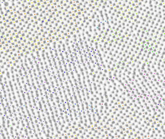
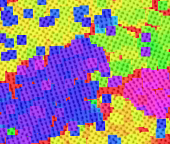
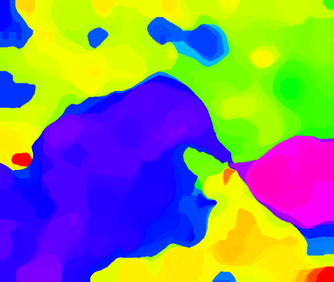
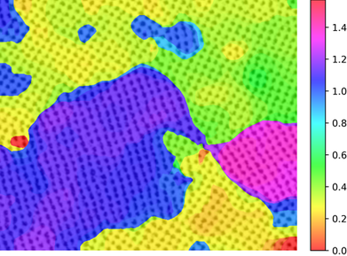

# Example 3 - Local Pattern Orientation

See [here](https://github.com/uw-comphys/shapelets/tree/main/examples/example_3) for example files and code. 

This example demonstrates computation of the local pattern orientation  for self-assembly microscopy imaging using the ``shapelets.self_assembly`` submodule.

This example can be run in two different ways:
* (1) text-based configuration files (shown here), and 
* (2) programmatically via script-based Python programming (`example_3.py`)

This example will go through the text-based configuration file approach (1). For users comfortable with Python programming, the example_3.py file is setup to run the same analysis described below. The outputs will appear in the same directory.

## Overview

Local pattern orientation is concerned with the relative orientation of nanostructure along grain boundaries and in between grains. The local pattern orientation method ([M.P. Tino (2024)](http://dx.doi.org/10.1088/1361-6528/ad1df4)) contains three (3) main steps:

* (1) **Masking**: Performed for well-defined features using a specific response threshold. This threshold is found via an interative scheme. Only the orientation values from these well-defined features are retained after masking.
* (2) **Dilation**: Performed via morphological greyscale dilation from ``scipy.ndimage.grey_dilation`` ([P. Virtanen (2020)](https://doi.org/10.1038/s41592-019-0686-2)) to expand the orientation from well-defined features and define orientation in void space (between well-defined features and over orientational boundaries). The dilation kernel size is chosen to be $2\lambda$, where $\lambda$ is the characteristic wavelength of the pattern and is also the approximate distance between well-defined features. 
* (3) **Blending**: Performed via a median filter from `scipy.ndimage.median_filter`` ([P. Virtanen (2020)](https://doi.org/10.1038/s41592-019-0686-2)) to allow for effective transition in orientations between neighbouring well-defined features and across orientational boundaries. The blending kernel size is chosen to be $4\lambda$ so that the orientation is averaged from two layers of surrounding neighbouring features.

It is also important to note that this pattern orientation method ([M.P. Tino (2024)](http://dx.doi.org/10.1088/1361-6528/ad1df4)) is only applicable to images with **one** dominant pattern type. I.e., images with mixed patterns are invalid. 

The example [directory](https://github.com/uw-comphys/shapelets/tree/main/examples/example_3) should contain the following.

where **config** is the text-based configuration file, **example_3.py** is the Python script file, and **images/** holds the experimental square self-assembled nanostructure image ([C. Tang (2008)](https://doi.org/10.1126/science.1162950)) for analysis.

## Configuration File Method

### Setup

The configuration file provided in the example [directory](https://github.com/uw-comphys/shapelets/tree/main/examples/example_3) contains the following information:

	[general]
	image_name = sqrAFM2.png
	method = orientation

	[orientation]
	pattern_order = square

where **image_name** and **method** are required parameters that specify the image filename and method used for analysis.

The method outlined in the configuration file will also have its own header with specific parameters. The orientation method must contain one parameter, described below.

**pattern_order** `str`

* The pattern order (symmetry) observed in the image. Options are `stripe`, `square`, `hexagonal`

## Run Example

Please ensure that `shapelets` is properly installed before proceeding. 
See [here](https://uw-comphys.github.io/shapelets/shapelets/docs/installation_guide.html) for installation instructions.

Navigate your terminal to "shapelets/examples/example_3". When you are ready, execute ``shapelets config`` in the command line.

Depending on your computer hardware, the iterative convergence scheme may take a couple of minutes.

The output (shown below) will then be available in "shapelets/examples/example_3/output" containing the mask (top left), dilated feature orientation (top right), smoothed orientation result, and the smoothed orientation result superimposed onto the original pattern (shown below, respectively).

