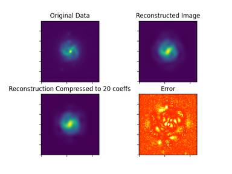

# Example 4 - Galactic Image Decomposition

See [here](https://github.com/uw-comphys/shapelets/tree/main/examples/example_4) for files and code related to this example. 

This example demonstrates the galaxy decomposition and reconstruction method ([A. Refregier (2003)](https://doi.org/10.1046/j.1365-8711.2003.05901.x)) implemented via multiple functions in the ``shapelets.astronomy`` submodule for a FITS file, which contains a subset of images of galaxies from the Hubble Deep Field North ([A. Refregier (2003)](https://doi.org/10.1046/j.1365-8711.2003.05901.x)). 
This data is shown below as linear (left) and mean normalized (right) greyscale images. 

## Overview

The astronomical intensity/pixel data collected from the Hubble telecsope is is stored in a .fits file.
Flexible Image Transport System (or FITS) ([S. Allen (2005)](https://fits.gsfc.nasa.gov/rfc4047.txt)) was designed to standarize the exchange of astronomical image data between observatories.
FITS provides a method to transport arrays and tables of data alongside its related metadata. 

These intesities represent localized celestial objects (such as galaxies) that, once seperated from the original image, can be decomposed into a linear combination of shapelet functions. The method contains four (4) main steps:

* (1) **Source Extractor**: using Source Extractor ([E. Bertin (1996)](https://ui.adsabs.harvard.edu/link_gateway/1996A&AS..117..393B/doi:10.1051/aas:1996164)), subdomains containing localized intensities are selected from the intensity data, and categorized as galaxies or stars by pixel cluster size.

* (2) **Shapelet Projection**: the subdomain is projected onto a collection of 2D cartesian shapelets using a beta and centroid initially estimated by Source Extracter and $n$ such that $n_1 + n_2 \leq n_{max}$.

* (3) **Shapelet Parameter Optimization**: using formulae from ref. [A. Refregier (2003)](https://doi.org/10.1046/j.1365-8711.2003.05901.x), the object's centroid and characteristic size are estimated from the decomposed shapelet coefficients and used as an updated beta and centroid for a more optimized decomposition.

* (4) **Shapelet State Compression**: the shapelet coefficients are truncated, removing insignificant contributions to the shapelet representation. This truncated representation is then used to reconstruct the original image and the error associated with this reconstruction (i.e. from truncation) is computed.

Steps 2-3 are repeated for all galaxies identified by the **Source Extractor**.

## Configuration File

### Setup

The example [config](https://github.com/uw-comphys/shapelets/tree/main/examples/example_4) contains the following:

	[general] 
	method = galaxy_decompose
	fits_name = galaxies.fits 

	[galaxy_decompose] 
	shapelet_order = default 
	compression_order = 20 

where **image_name** and **method** are required parameters that specify the image filename and method used for analysis, respectively.

The **galaxy_decompose** method requires two parameters.

**shapelet_order** `int` (required)

* The maximum shapelet order (i.e. cartesian shapelets ([A. Refregier (2003)](https://doi.org/10.1046/j.1365-8711.2003.05901.x))) to calculate coefficients such that $n_1 + n_2 \leq n_{max}$.
* Example values: `default` (recommended), `10`, `20`

**compression_order** `int` (required)

* The number of shapelet coefficients to use for final image reconstruction
* Example values: `20`, `25` (recommended)

### Run Example

Ensure `shapelets` is installed before proceeding.
See [here](https://uw-comphys.github.io/shapelets/shapelets/docs/installation_guide.html) for installation instructions.

This example assumes the working directory has a sub-directory ``analysis`` containing the necessary files: ``analysis/config`` and ``analysis/images/galaxies.fits``. 

To run the example, execute ``shapelets-run ./analysis/config`` in the command line.

The output (shown below) will then be available in ``./analysis/output`` where the first (left) image contains the ellipses enclosing the locations of galaxies superimposed on the linear and mean normalized image. 

The second image (right) contains information about the first decomposed galaxy, such as:
* the subdomain of the original image containing the galaxy,
* a reconstruction of the galaxy using the all calculated coefficients and a compressed set coefficients, and
* the compressed reconstruction's relative error

## Additional Notes

For users who do not wish to use configuration files and would prefer to interact with shapelets via standard python programming, please see the ``example_4.py`` script [here](https://github.com/uw-comphys/shapelets/tree/main/examples/example_4).
You can use this script as a template to conduct your own analyses.