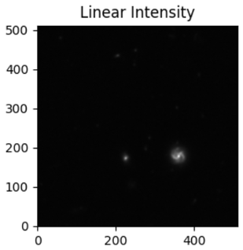
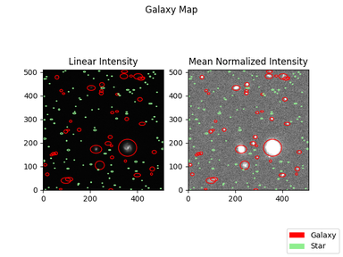

# Example 4 - Galactic Image Decomposition

See [here](https://github.com/uw-comphys/shapelets/tree/main/examples/example_4) for example files and code. 

This example demonstrates the decomposition and reconstruction of images of galaxies ([A. Refregier (2003)](https://doi.org/10.1046/j.1365-8711.2003.05901.x)) using the ``shapelets.astronomy`` submodule.

This example can be run in two different ways:
* (1) text-based configuration files (shown here), and 
* (2) programmatically via script-based Python programming (`example_4.py`)

## Overview

The astronomical intensity/pixel data collected from the Hubble telecsope is is stored in a .fits file.
Flexible Image Transport System (or FITS) ([S. Allen (2005)](https://fits.gsfc.nasa.gov/rfc4047.txt)) was designed to standarize the exchange of astronomical image data between observatories.
FITS provides a method to transport arrays and tables of data alongside its related metadata. 

These intesities represent localized celestial objects (such as galaxies) that, once seperated from the original image, can be decomposed into a linear combination of shapelet functions. The method contains four (4) main steps:

* (1) **Source Extractor**: using Source Extractor ([E. Bertin (1996)](https://ui.adsabs.harvard.edu/link_gateway/1996A&AS..117..393B/doi:10.1051/aas:1996164)), subdomains containing localized intensities are selected from the intensity data, and categorized as galaxies or stars by pixel cluster size.

* (2) **Shapelet Projection**: the subdomain is projected onto a collection of 2D cartesian shapelets using a beta and centroid initially estimated by Source Extracter and $n$ such that $n_1 + n_2 \leq n_{max}$.

* (3) **Shapelet Parameter Optimization**: using formulae from ref. [A. Refregier (2003)](https://doi.org/10.1046/j.1365-8711.2003.05901.x), the object's centroid and characteristic size are estimated from the decomposed shapelet coefficients and used as an updated beta and centroid for a more optimized decomposition.

* (4) **Shapelet State Compression**: the shapelet coefficients are truncated, removing insignificant contributions to the shapelet representation. This truncated representation is then used to reconstruct the original image and the error associated with this reconstruction (i.e. from truncation) is computed.

Steps 2-3 are repeated for all galaxies identified by the **Source Extractor**.

The example [directory](https://github.com/uw-comphys/shapelets/tree/main/examples/example_4) should contain the following.

where **config** is the text-based configuration file, **example_4.py** is the Python script file, and **images/** holds the FITS file used in this example which contains a subset of images of galaxies from the Hubble Deep Field North ([A. Refregier (2003)](https://doi.org/10.1046/j.1365-8711.2003.05901.x)). This data is shown below as the linear (left) and mean normalized (right) greyscale images. 

## Configuration File Method

### Setup

The configuration file provided in the example [directory](https://github.com/uw-comphys/shapelets/tree/main/examples/example_4) contains the following information:

	[general] 
	method = galaxy_decompose
	fits_name = galaxies.fits 

	[galaxy_decompose] 
	shapelet_order = default 
	compression_order = 20 

where **image_name** and **method** are required parameters that specify the image filename and method used for analysis.

The method outlined in the configuration file will also have its own header with specific parameters. The **galaxy_decompose** method may contain up to two parameters.  Only values that have a default value may be omitted from the configuration file (see below, if no default value is written then it must be present in configuration file). 

**shapelet_order** `int`

* The maximum shapelet order (i.e. cartesian shapelets ([A. Refregier (2003)](https://doi.org/10.1046/j.1365-8711.2003.05901.x))) to calculate coefficients such that $n_1 + n_2 \leq n_{max}$.
* Default value is 10

**compression_order** `int`

* The number of shapelet coefficients to use for final image reconstruction
* Default value is 25. Here 20 is used just as an example

### Run Example

Please ensure that `shapelets` is properly installed before proceeding.
See [here](https://uw-comphys.github.io/shapelets/shapelets/docs/installation_guide.html) for installation instructions.

Navigate your terminal to "shapelets/examples/example_4". When you are ready, execute ``shapelets config`` in the command line.

The output (shown below) will be available in "shapelets/examples/example_4/output" and the first (left) image contains the ellipses enclosing the locations of galaxies superimposed on the linear and mean normalized image. 

The second image contains information about the first decomposed galaxy, such as:
* the subdomain of the original image containing the galaxy,
* a reconstruction of the galaxy using the all calculated coefficients and a compressed set coefficients, and
* the compressed reconstruction's relative error

## Scripting Method 

For users comfortable with Python programming, the example_4.py file is structured to run the same analysis as described previously. The outputs will appear in the same directory.
